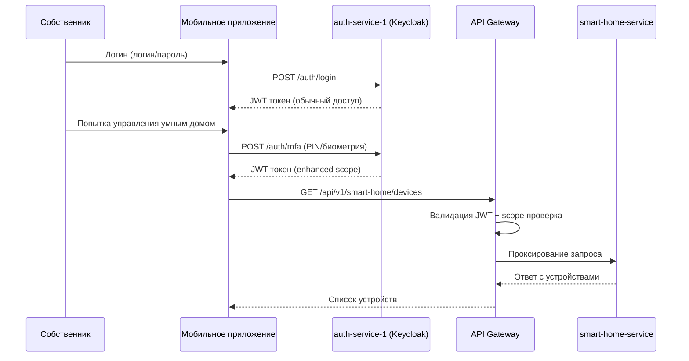
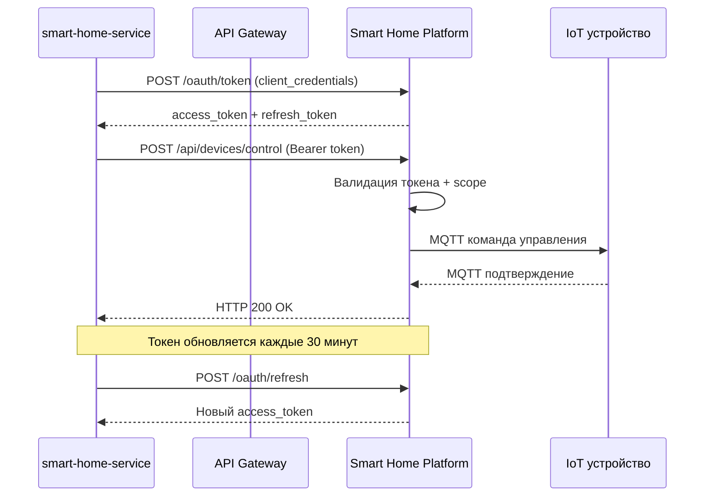

# Требования к интеграции сервисов "Умный дом" для PropDevelopment

---

### 1. Scope интеграции
**Включено:**
- Интеграция с внешней Smart Home Platform партнера
- Управление интеллектуальным домофоном с биометрией
- Управление интеллектуальным шлагбаумом с распознаванием номеров
- Расширение мобильного приложения собственников
- Новый microservice для управления умными устройствами

**Исключено:**
- Прямое взаимодействие мобильного приложения с IoT устройствами
- Хранение биометрических данных в системах PropDevelopment
- Интеграция с другими IoT платформами (только с выбранным партнером)

---

## 2. Требования к безопасности

### 2.1. Аутентификация и авторизация

#### 2.1.1. Аутентификация пользователей
| Требование | Описание | Приоритет |
|------------|----------|-----------|
| **USER_AUTH_001** | Все пользователи мобильного приложения должны проходить аутентификацию через существующий auth-service-1 (Keycloak) | Критический |
| **USER_AUTH_002** | Для функций умного дома требуется дополнительная аутентификация (PIN-код или биометрия) | Высокий |
| **USER_AUTH_003** | Токены доступа должны иметь ограниченный срок действия (не более 1 часа для IoT функций) | Высокий |
| **USER_AUTH_004** | Обязательная повторная аутентификация при критических операциях (управление доступом в дом) | Критический |

#### 2.1.2. Service-to-Service аутентификация
| Требование | Описание | Приоритет |
|------------|----------|-----------|
| **SVC_AUTH_001** | Взаимодействие между smart-home-service и внешней платформой через OAuth 2.0 Client Credentials | Критический |
| **SVC_AUTH_002** | Использование взаимной TLS аутентификации (mTLS) для критических операций | Высокий |
| **SVC_AUTH_003** | API ключи партнера должны ротироваться каждые 90 дней | Средний |
| **SVC_AUTH_004** | Все сервисные токены должны содержать scope ограничения | Высокий |

#### 2.1.3. Авторизация доступа
| Требование | Описание | Приоритет |
|------------|----------|-----------|
| **AUTHZ_001** | Собственники могут управлять только устройствами своего ЖК | Критический |
| **AUTHZ_002** | Разграничение доступа: собственники, арендаторы, гости, администраторы УК | Критический |
| **AUTHZ_003** | Временные разрешения для гостей с автоматическим истечением | Высокий |
| **AUTHZ_004** | Ролевая модель доступа (RBAC) с поддержкой иерархии ЖК → подъезд → квартира | Высокий |
| **AUTHZ_005** | Аудит всех операций авторизации с возможностью отслеживания цепочки доступа | Критический |

### 2.2. Защита данных

#### 2.2.1. Шифрование данных
| Требование | Описание | Приоритет |
|------------|----------|-----------|
| **CRYPTO_001** | Все API вызовы должны использовать TLS 1.3 или выше | Критический |
| **CRYPTO_002** | Биометрические данные не должны передаваться в открытом виде (только хеши/токены) | Критический |
| **CRYPTO_003** | Номера автомобилей должны быть зашифрованы в БД с использованием AES-256 | Высокий |
| **CRYPTO_004** | Конфигурации устройств содержат чувствительные данные - шифрование at rest | Высокий |
| **CRYPTO_005** | Ключи шифрования должны управляться через HSM или Key Management Service | Средний |

#### 2.2.2. Обработка персональных данных
| Требование | Описание | Приоритет |
|------------|----------|-----------|
| **PII_001** | Соблюдение требований ФЗ-152 для обработки биометрических данных | Критический |
| **PII_002** | Биометрические данные обрабатываются только на стороне партнера | Критический |
| **PII_003** | Логи не должны содержать персональные данные в открытом виде | Высокий |
| **PII_004** | Обезличивание данных для аналитики и отчетности | Высокий |
| **PII_005** | Возможность полного удаления данных пользователя по запросу | Критический |

#### 2.2.3. Изоляция данных
| Требование | Описание | Приоритет |
|------------|----------|-----------|
| **ISOL_001** | Строгая изоляция данных между разными ЖК на уровне БД | Критический |
| **ISOL_002** | Tenant-based изоляция в API Gateway для мультитенантности | Критический |
| **ISOL_003** | Отдельные namespace/контексты для каждого ЖК в партнерской системе | Высокий |
| **ISOL_004** | Валидация принадлежности пользователя к ЖК при каждом запросе | Критический |

### 2.3. Сетевая безопасность

#### 2.3.1. Защита периметра
| Требование | Описание | Приоритет |
|------------|----------|-----------|
| **NET_001** | Все внешние интеграции проходят через API Gateway | Критический |
| **NET_002** | Whitelist IP адресов партнерской платформы | Высокий |
| **NET_003** | DDoS защита на уровне API Gateway | Высокий |
| **NET_004** | Rate limiting для API вызовов (макс 100 req/min на пользователя) | Средний |
| **NET_005** | Web Application Firewall (WAF) для фильтрации запросов | Высокий |

#### 2.3.2. Внутренняя сегментация
| Требование  | Описание | Приоритет |
|-------------|----------|-----------|
| **SEG_001** | smart-home-service изолирован в отдельной сетевой зоне | Высокий |
| **SEG_002** | Доступ к smart-home-db только из smart-home-service | Критический |

---

## 3. Протоколы аутентификации и авторизации

### 3.1. Схема аутентификации пользователей

### 3.2. Service-to-Service аутентификация

---

## 4. Взаимодействие между системами

#### Компоненты интеграции
1. **API Gateway (Kong/AWS API Gateway)**
    - Централизованная точка входа для всех API
    - Аутентификация, авторизация, rate limiting
    - Трансформация запросов и маршрутизация
    - Логирование и мониторинг

2. **smart-home-service (Kotlin + SpringBoot)**
    - Бизнес-логика управления умными устройствами
    - Интеграция с внешней платформой партнера
    - Кеширование состояния устройств
    - Обработка событий и уведомлений

3. **smart-home-db (PostgreSQL)**
    - Конфигурации устройств и пользовательские настройки
    - Логи событий и аудит действий
    - Кеш данных от партнерской платформы
    - Метаданные интеграции
